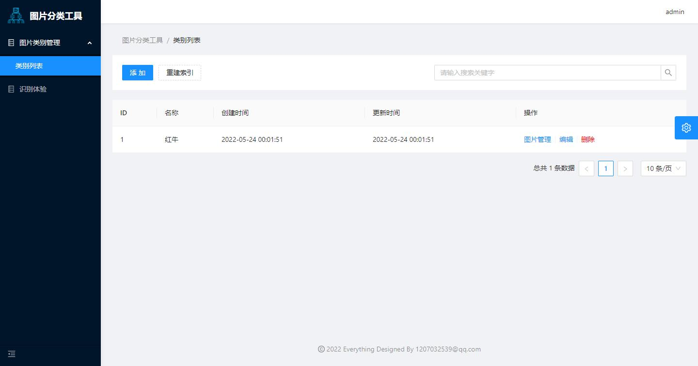
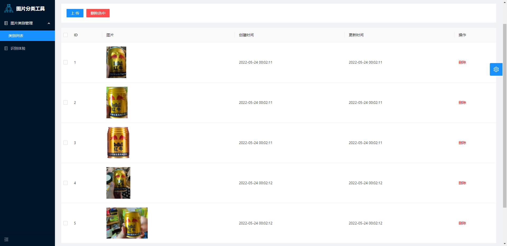
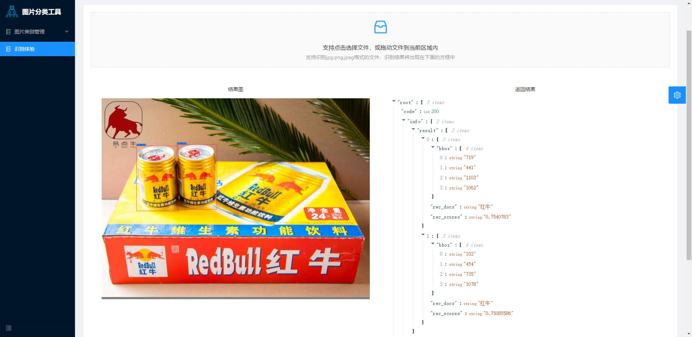

# 图片分类工具

### 特性

- 后端：flask框架 前端：ant design pro v5
- 图片识别分类技术：百度飞浆的pp-shitu
- 主要功能模块：类别管理、类别图片管理、识别体验

### 安装

```
//第一次启动需要安装基础组件，可能需要消耗等待几分钟，等待一下即可访问页面
docker-compose up -d
```

### 访问

容器运行成功后，访问：http://ip:5566/
初始账号: admin 密码: linzhou

# 使用截图

- 类别创建
  
- 类别图片管理
  
- 识别体验
  

